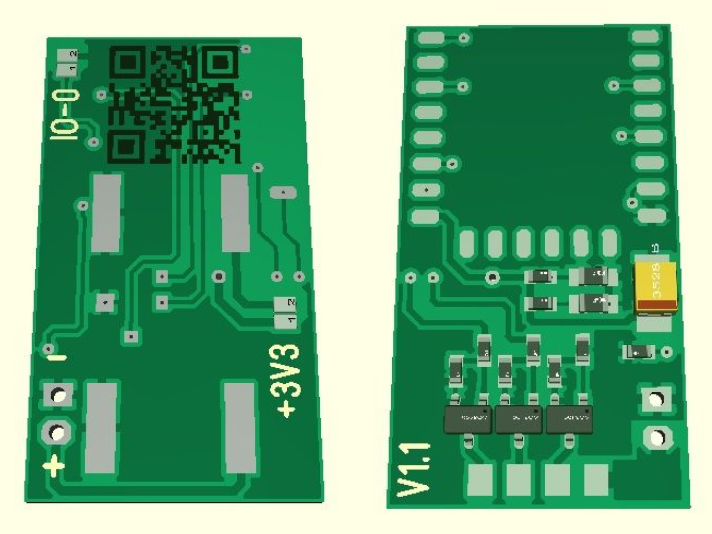
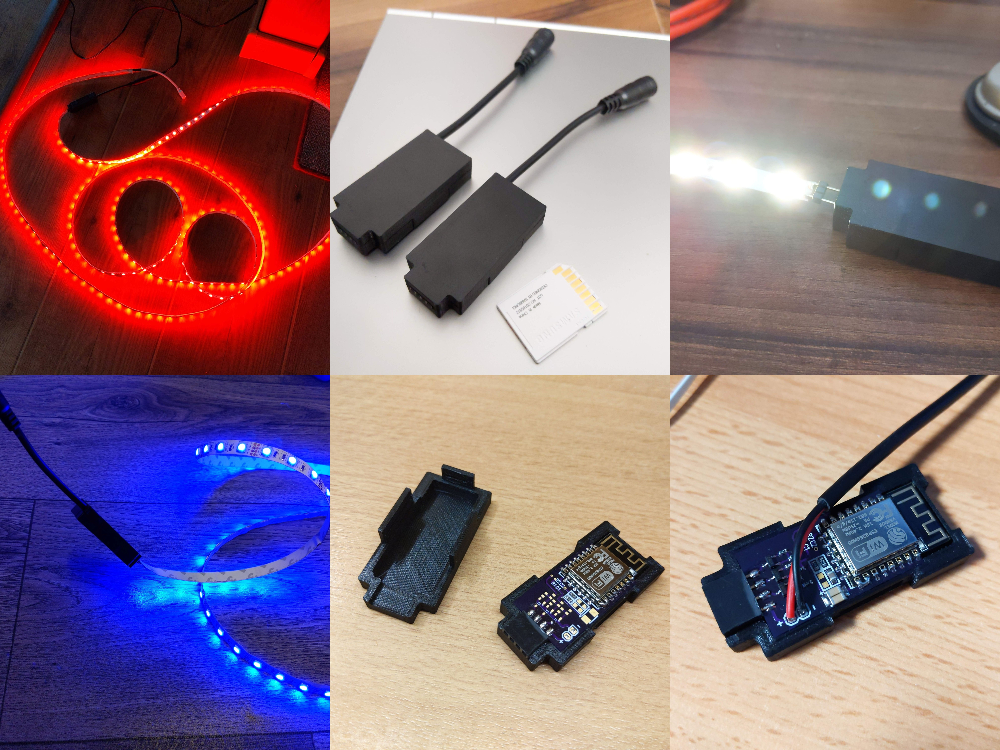

# RGB-Controller
This is a low cost and tasmota compatile RGB-Controller as an alternative to MagicHome devices.
Everything is untested until now. The first prototypes are orderd. If the PCBs work I'll share the OSHPark link here.

# Some specs:
- operating voltage 12V (becaus of the mini360)
- max current per channel (color) 5A in theory 
- fully compatible with [Tasmota](https://github.com/arendst/Tasmota)
- price/piece around 5.60€
- dimensions 20mm x 35mm

# known bugs:
- GPIO15 is not connected to GND so ESP won't startup --> fixed
- Solder Mask isn't on via's, so may be a risk of short circuit --> fixed
- Track width of RGB strip supply is a bit too small, could be more --> fixed

# Pictures:

